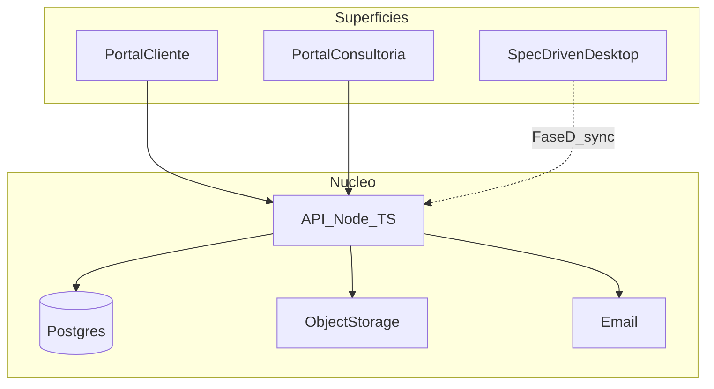

# Roadmap: SpecDriven solução completa

## Decisões travadas

- **Tenancy:** uma consultoria (a sua) + N clientes finais. Modelo single-tenant da org; schema já com `organizationId` / `clientId` para não travar um SaaS multi-consultoria depois.
- **Stack:** Node/TypeScript (API) + React (portais) + SpecDriven Tauri (desktop consultor).
- **Desktop atual:** local-first; sync cloud na Fase D (modo Local | Cloud).

## Arquitetura alvo




| Superfície                                          | Quem                     | Escopo                                                      |
| --------------------------------------------------- | ------------------------ | ----------------------------------------------------------- |
| Portal cliente (O mais simplificado para o cliente) | Usuário do cliente final | Abrir/acompanhar chamado, comentar, anexar, ver status      |
| Portal consultoria                                  | Consultor + gestor       | Fila, atribuição, status, horas, relatórios, clientes       |
| Desktop SpecDriven                                  | Consultor                | Timer, EF/ET/TU, prints, produtividade offline; sync cloud  |


## Fases

### Fase 0 — Desktop local (já em curso / backlog curto)

Manter e polir o que existe em `[SpecDriven](D:\Aceleradores\SpecDriven)`:

- Templates Word reais, busca em notas, horas por intervalo, atalhos, favoritos
- Qualidade: testes docx/validação, auto-save draft, limpar `overwrite` morto

**Critério de pronto:** consultor opera bem 100% local sem cloud.

### Fase A — Núcleo cloud MVP (~6–10 semanas, 1–2 eng)

**Repo sugerido:** monorepo `specdriven-platform/` com `apps/api`, `apps/web-staff`, `apps/web-client`, `packages/shared`.

**API (Node/TS):**

- Auth: e-mail + senha; convite por e-mail; papéis `gestor` | `consultor` | `cliente`
- Entidades: Organization (fixa), Client, User, Ticket, Comment, Attachment
- Ticket: key, título, status, prioridade, tags, assignee, estimativa, timestamps
- Status alinhados ao desktop: `backlog`, `em_andamento`, `aguardando_cliente`, `em_teste`, `concluido`, `cancelado`
- Upload anexos → object storage (S3/R2/MinIO)
- E-mail transacional: chamado criado, novo comentário, mudança de status
- Postgres + migrations (Prisma ou Drizzle)
- OpenAPI / tipos compartilhados em `packages/shared`

**Fora da Fase A:** SLA engine, Kanban avançado, billing, SSO, app mobile, sync desktop.

### Fase B — Portal cliente (~3–5 semanas após A)

- Login cliente (só tickets do(s) client(s) vinculados)
- Criar chamado (título, descrição, anexos)
- Timeline: comentários + mudanças de status (read-only de campos internos da consultoria)
- Lista “meus chamados” com filtro status

**Critério:** cliente abre e acompanha sem Jira.

### Fase C — Portal consultoria (~4–6 semanas)

- Login staff (consultor/gestor)
- Fila global + por cliente; atribuir consultor
- Detalhe chamado (comentários internos vs visíveis ao cliente)
- Relatórios básicos: abertos por status, por assignee
- Workflow Aprovação Chamados
- Workflow Aprovação Horas
- Limite de horas por ticket (Gestor definido aprovará requisição)
- Gestão de usuários cliente (convites) e cadastro de clientes
- Gestor: ver todos; consultor: atribuídos + não atribuídos (regra simples)

Reusar UI patterns do SpecDriven React onde fizer sentido (não copiar shell Tauri).

### Fase D — Desktop ↔ núcleo (~4–8 semanas)

Ligar SpecDriven Tauri ao API:

- Login no desktop + escolher modo **Local** | **Cloud**
- Sync: tickets/meta/comentários/horas (pull/push)
- Docs EF/ET/TU e prints: gerar no desktop; upload do `.docx` gerado como anexo do ticket cloud (híbrido — não reescrever engine docx na API no início)
- Timer continua no processo local; entradas de horas sobem no stop/sync

**Critério:** consultor usa overlay/docs no desktop em cima de chamados abertos pelo cliente no portal.

### Fase E — Operação séria (contínuo)

- SLA / prazos, alertas
- Comentários internos vs públicos (se não veio em C)
- Horas multi-user no portal + CSV intervalo
- Busca full-text
- Audit log
- Templates Word na cloud (opcional)
- Soft-delete / lixeira
- Observabilidade (logs, backups, LGPD export/delete)
- Facilitar montagem de relatórios no portal de forma individual
- Determinação de fator hora para consultores mais caros individualmente (exemplo, consultor x tem taxa hora mais alta, atendimento dele é calculado com um adicional de x%, invisivel ao cliente, controle consultoria)
- Controle de baseline por cliente, com valor de taxa hora
- Diferenciar tipos de chamado (melhorias,incidentes, duvidas, problemas, seguir ITIL)
- Definir parametro para chamados que são contabilizados no baseline e chamados que não são
- Configuração SLA - Horas uteis - individual por projeto
- Envio de e-mail automatizado quando respondido na plataforma

## Modelo de dados (núcleo — essência)

- `organizations` (1 row no MVP)
- `clients` (clientes finais)
- `users` + `memberships` (role + clientId nullable para staff)
- `tickets` (clientId, key unique por org, status, assigneeId…)
- `comments` (ticketId, authorId, body, visibility: `public` | `internal`)
- `attachments` (ticketId, storageKey, fileName)
- `time_entries` (opcional na A; forte na D/E)
- `invites` (e-mail, role, clientId, token, expires)

Chave tipo Jira: mesma regex do desktop `^[A-Z][A-Z0-9]+-\d+$`, sequência por prefixo/projeto depois se precisar.

## Papéis e permissões (MVP)


| Ação                       | Cliente | Consultor      | Gestor |
| -------------------------- | ------- | -------------- | ------ |
| Criar ticket (seu cliente) | sim     | sim            | sim    |
| Comentar público           | sim     | sim            | sim    |
| Comentar interno           | não     | sim            | sim    |
| Mudar status / assignee    | não     | sim            | sim    |
| Ver todos os clientes      | não     | conforme regra | sim    |
| Convidar usuários          | não     | limitado       | sim    |


## Sequência de entrega recomendada

```text
Fase0 desktop polish (paralelo)
    → FaseA API+auth+tickets
        → FaseB portal cliente
            → FaseC portal consultoria
                → FaseD sync desktop
                    → FaseE operação
```

Portal consultoria **depois** do cliente: valida o fluxo “cliente abre → staff atende” com menos UI staff no começo (staff pode usar API/admin mínimo ou UI staff thin na A se urgente — default: UI staff completa só na C).

## Esforço (ordem de grandeza, 1–2 eng)


| Fase                 | Semanas  |
| -------------------- | -------- |
| A Núcleo             | 6–10     |
| B Portal cliente     | 3–5      |
| C Portal consultoria | 4–6      |
| D Sync desktop       | 4–8      |
| E Operação           | contínuo |


Total até D útil em produção: **~4–7 meses**.

## Primeiro artefato concreto (quando executar este roadmap)

1. Criar monorepo `specdriven-platform` com API Hello + Postgres + schema `organizations/clients/users/tickets`.
2. Documentar contratos em `docs/` do monorepo (espelhar estilo de `[docs/](D:\Aceleradores\SpecDriven\docs)`).
3. Manter SpecDriven desktop como repo/produto separado até Fase D.

## Relação com o plano curto já executado

Itens nav/Home/overlay/campos/prints **já feitos** no desktop. Este roadmap **não os reabre** — só encaixa o desktop na jornada maior (Fase 0 → D).

## Log de execução (2026-07-13)

### Concluído
- **Fase 0 (desktop SpecDriven):** removidos `chrono-tz` e flag `overwrite`; auto-save draft no wizard; testes Rust **10 passed**; `tsc` frontend OK; docs sync.
- **Fase A bootstrap (D:\Aceleradores\specdriven-platform):** monorepo npm workspaces, Fastify, `packages/shared`, Prisma schema, docker-compose, docs/. typecheck + prisma generate OK.
- **Fase A stub auth/tickets:** `POST /auth/login`, `GET /auth/me`, `GET|POST /tickets`, `GET /tickets/:key`, seed local, `DEV_AUTH_BYPASS`.
- **Infra local:** Docker `specdriven-postgres` healthy; `db:push` + `db:seed` OK.
- **Fase A clients/comentários/anexos:** `GET|POST /clients`, `GET|POST /tickets/:key/comments`, `GET|POST /tickets/:key/attachments` (metadados). Smoke login real `gestor@specdriven.local` PASS (mode=db).

### Fase B (iniciada 2026-07-13)
- `apps/web-client` (Vite/React): login, lista+filtro status, criar, detalhe, comentários públicos, anexos metadados.
- Seed `cliente@specdriven.local` / `changeme`; create ticket guarda escopo `clientId` do role cliente.
- Docs: `docs/portal-cliente.md` + README/scripts `dev:web-client`.
- **Polimento B:** `GET /tickets?status=` server-side; `POST /tickets` gera key `{client.code}-{n}` (cliente sem input); UX anexos com seletor de arquivo (mime/size).

### Fase C–E + catch-all (2026-07-13, workstream SpecDriven catch-all)
- **OpenAPI:** `@fastify/swagger` + UI em `/docs`; CI GitHub Actions (`typecheck` + `build`).
- **Hardening:** headers segurança, rate limit login, `JWT_SECRET` obrigatório em production.
- **Fase D:** `GET /sync/pull`, `POST /sync/push`; desktop Configurações Local|Cloud; push horas no stop do timer; docs `sync-desktop.md`.
- **Fase E (fora dos 4 WS paralelos):** busca `/search`; time-entries + CSV; notificações in-app; billing (fator hora + baseline + summary); soft-delete/restore; LGPD export/delete; audit log; `ticketType` + `countsTowardBaseline`.
- **CI:** `.github/workflows/ci.yml`.

### Deixado para workstreams dedicados (não bloqueiam núcleo catch-all)
- Users picker UI
- SMTP real / e-mail em comentário
- SLA engine UI fina + tags/histórico (API já existia em paralelo)

### Workflows aprovação (2026-07-13) — CONCLUÍDO
- Schema: `ApprovalRequest`, `hourLimitMinutes`, `TimeEntry.approvalStatus`
- API: `GET|POST /approvals`, `POST /approvals/:id/approve|reject` (gestor), `PATCH /tickets/:key/hour-limit`, time-entries com gate de limite
- UI staff: `/approvals` (`ApprovalsPage.tsx`)
- Seed DEMO-1 + docs `aprovacoes.md`; typecheck + smoke approve/reject PASS

### Gaps conscientes (não inventados fora do plano)
- ~~Pull cloud não grava tickets no filesystem~~ — **fechado:** `apply_cloud_pull_cmd` materializa tickets/comentários/horas no disco após `GET /sync/pull` (docs `sync-desktop.md`).
- ~~Upload `.docx` automático no wizard~~ — **fechado (2026-07-13 integração):** após gerar, modo Cloud + token → `read_workspace_file_base64` + `cloudUploadDocx` (best-effort; MinIO/S3 para multipart).
- Templates Word na cloud (opcional no plano — Fase E contínuo).
- Relatórios individuais avançados no portal (plano contínuo Fase E).

### Integração pós-paralelo (2026-07-13, workstream SpecDriven)
- Typecheck + build `specdriven-platform` OK; desktop `tsc` OK.
- Smoke API: `GET /health` ok; `POST /auth/login` gestor → token OK.
- Todos YAML do roadmap (fases 0–E núcleo): `completed`.
- **Ainda fora do “100%” do plano contínuo (não quebram núcleo):** templates Word cloud; relatórios individuais avançados; SMTP produção; users picker fino; SLA UI fina.
- `cargo` fora do PATH nesta sessão — comando Rust `read_workspace_file_base64` adicionado; validar com `cargo check` quando PATH tiver Rust.

### Bloqueio infra
- Nenhum no momento (Docker OK: postgres/minio/mailpit).

### Sem commits (aguardando pedido explícito).
